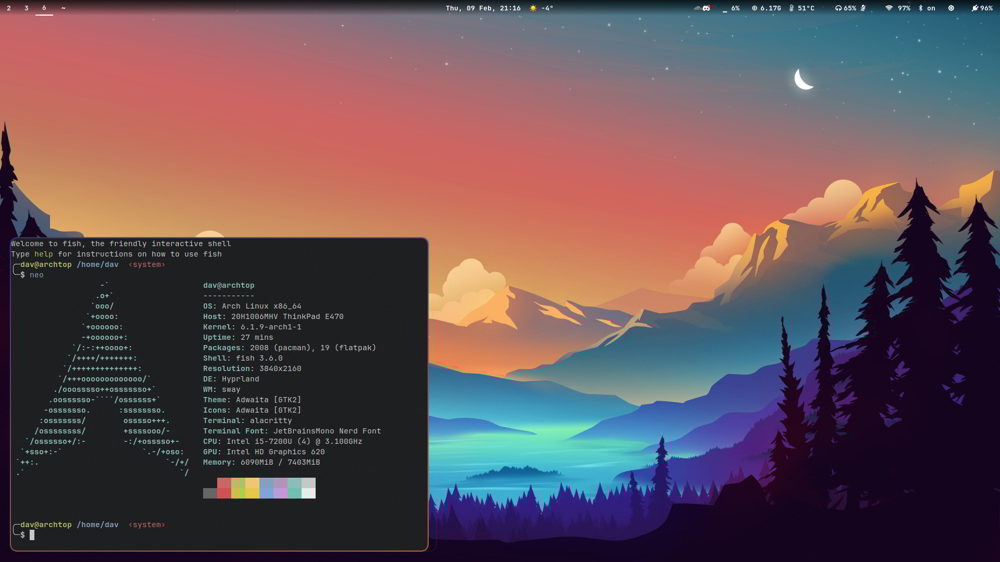

# dotfiles

## Installation
It is **recommended** to first fully read this readme before starting anything.
1. Prerequisites
    - Install [these packages](#packages-used) using your package manager
    - Install [this font](#font) either using your package manager or manually
    - Clone this repo
1. Configuration
    - Copy the required config files from this repo to their respective config path, which you can also [find here](#packages-used)
    - Copy the `wrappedhl` file to `/bin/` and give it execute perms
    - Copy the `wrappedhl.desktop` file to `/usr/share/wayland-sessions/`
1. Enjoy!
    > Next time you login, select `Hyprland wrapped` as the active session.

If you run into problems, check out the [common problems](#common-problems) section.

## Packages used
Below are the valid configuration directory/file paths listed
- [alacritty](https://wiki.archlinux.org/title/Alacritty#Configuration)
  - `~/.config/alacritty/alacritty.yml`
  - `~/.alacritty.yml`
- [fish](https://wiki.archlinux.org/title/Fish#Configuration)
  - `~/.config/fish/config.fish`
- [hyprland](https://wiki.hyprland.org/Getting-Started/Master-Tutorial/)
  - `~/.config/hypr/hyprland.conf`
- [light](https://wiki.archlinux.org/title/Backlight#light)
  - `~/.config/light/`
- [waybar](https://github.com/Alexays/Waybar/wiki)
  - `~/.config/waybar/`
  - `~/waybar/`
  - `/etc/xdg/waybar/`

## Font
This config is using JetBrainsMono [NerdFonts patched version](https://github.com/ryanoasis/nerd-fonts) and thus it is mostly configured to use that.
I personally use the `ttf-jetbrains-mono-nerd` package from the [AUR](https://archlinux.org/packages/community/any/ttf-jetbrains-mono-nerd/).

## Backlight
It is configured to work on my system and may not work on yours. By default my user did not have write access to modify the brightness so I created a udev rule.

## Common problems
- The brightness control does not work.
    > Copy `udev-rules/backlight.rules` to `/etc/udev/rules.d/`.
    > 
    > If it *still* doesn't work, try modifying the device path inside of the file from `/sys/class/backlight/intel_backlight/brightness` to one that applies to your system [(info)](#backlight).

- Screenshots don't work.
    > Make sure `xdg-desktop-portal` and `xdg-desktop-portal-wlr` are installed.
